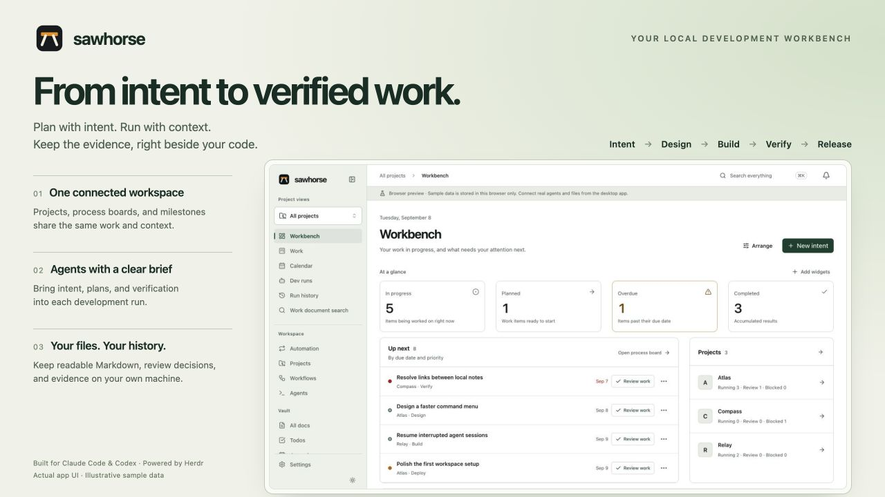
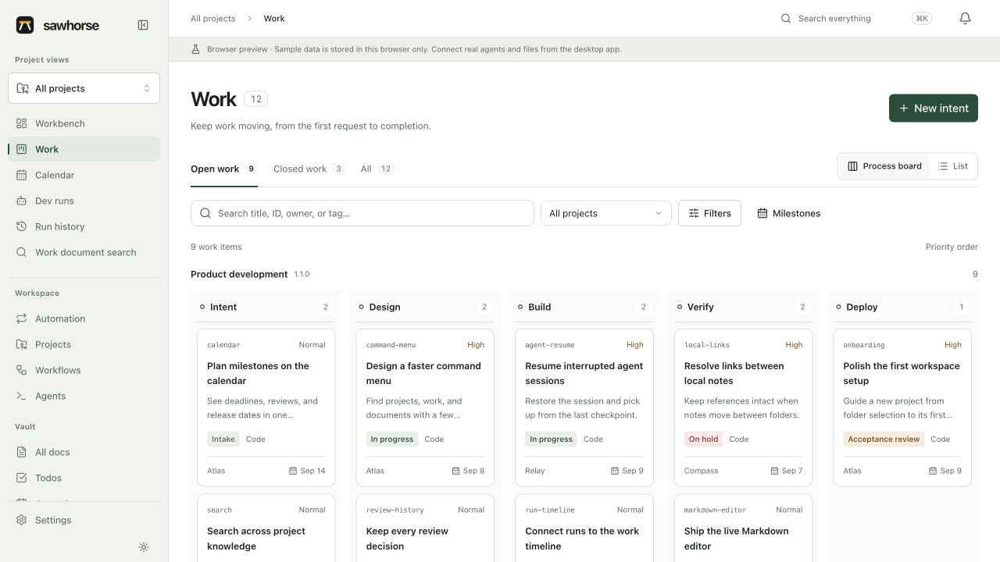
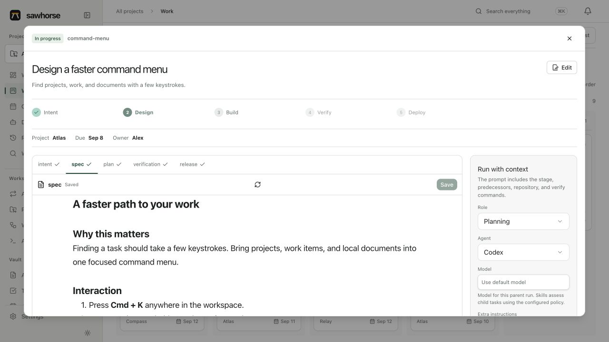

# Sawhorse



**의도에서 실행, 검증, 기록까지 이어지는 로컬 개발 작업대.**

인간이 `intent.md`에 의도를 남기면 AI가 설계와 작업 계획을 만들고, 인간의 승인 뒤 구현·검증하고 결과를 보고한다.
칸반·캘린더·마크다운 편집기·실행 하네스는 같은 작업과 프로젝트를 바라본다.
데이터는 로컬 Markdown에 남으며 Obsidian 없이도 앱만으로 편집하고 관리할 수 있다.

## 시작

```bash
cd app
npm ci
npm run tauri dev
```

기존 설치를 업데이트하면 첫 실행에서 이전 볼트와 Sawhorse 플러그인을 백업·검증 후 자동 갱신한다. [자동 업그레이드와 복구](docs/architecture/automatic-upgrades.md)를 참고한다.

처음 실행하면 설정 마법사에서 기록을 저장할 작업공간 경로를 정한다.
작업대에서 **작업공간 초기화**를 누른 뒤 **프로젝트**에 폴더를 등록한다. 이름은 폴더에서 따오고,
설명과 검증 명령은 저장 후 에이전트가 분석해 채운다. 기본 모델 목록은 에이전트 CLI에서 가져온다.
**새 의도**에서 메모와 이미지를 남기고 **설계 요청**을 누르면 개발 흐름을 시작할 수 있다. **메모만 저장**으로 기록부터 남길 수도 있다.

```bash
# UI만 체험: http://127.0.0.1:1420/?preview=1
npm run dev

# 검증
npm run build
npm run test:e2e
(cd src-tauri && cargo test --lib)

# 데스크톱 배포 번들
npm run tauri build
```

브라우저 체험은 예제 데이터를 브라우저에 저장한다. 실제 파일 접근과 에이전트 실행은
Tauri 데스크톱에서만 동작한다. 처음 UI 테스트를 실행할 때 `npx playwright install chromium`이 필요하다.

## 기본 화면

영문 UI에 예제 프로젝트와 작업을 넣은 실제 앱 화면이다. [캡처용 데모 실행과 이미지 재생성](docs/images/README.md)으로 같은 구성을 다시 열 수 있다.



<details>
<summary>작업 상세 — Markdown 명세와 에이전트 실행 맥락</summary>



</details>

| 화면 | 기능 |
|---|---|
| 작업대 | 진행 중 작업, 기한, 다음 작업, 단계별 분포 |
| 작업 | 같은 작업의 목록·공정 보드 전환, 작업 생성·편집, 마일스톤·프로젝트·의존 작업 연결 |
| 캘린더 | 월/목록 보기, 작업 기한, 마일스톤·검토·배포·회의 일정 |
| 작업 상세 | 선택한 워크플로우의 단계·결정 이력, Atomic Editor로 Markdown 직접 편집 |
| 에이전트 하네스 | 역할·모델 선택, Herdr 실행, 부모·자식 실행, 상태와 출력 기록 |
| 프로젝트 | 폴더 선택(첫 폴더가 기본), 폴더에서 따오는 이름, 분석으로 채워지는 설명·검증 명령, CLI 모델 목록, 기본 에이전트·모델 |
| 워크플로 | 단계·산출물·하위 흐름 편집, 시뮬레이션, 초안·불변 버전 발행·내보내기 |
| 스키마 | 문서 타입·필드·경로·템플릿 편집, 볼트 스캔, 링크/필드 변경 미리보기·적용·롤백·활성화 |
| 프로젝트 가져오기 | 여러 코드/문서 폴더 snapshot, 파일별 재개, 근거 문서 초안, 충돌 검토·적용 |
| 확장 | v2 패키지 설치·의존성 해석·권한 승인·프로젝트 lock·portable 내보내기 |
| 기록과 지식 | 작업공간 Markdown 검색과 산출물 이동 |

기존 루틴·잡·협업 세션·검토·소스·RSS·터미널과 확장 화면도 유지한다.

## 의도에서 결과까지

```text
인간의 의도 → AI 설계·작업 분해 → 인간 승인 → AI 구현·검증·보고 → 인간 결과 확인
intent.md     spec.md + plan.md    결정 기록   verification.md       완료 결정
```

작업 상세에서 현재 단계와 다음 행동, 연결된 실행과 단계별 문서 기록을 확인한다.
원본 의도와 수정 전 문서, 설계 검토·실행 입력·결과 인수 시점의 문서는 `work/<id>/history/`에 별도 보존한다.
승인 뒤 의도나 설계·계획이 바뀌면 다시 검토해야 구현 실행과 결과 인수를 진행할 수 있다.
기록은 이 기능 적용 이후부터 쌓이며, 기존에 덮어쓴 과거 내용은 복원하지 않는다.
[의도 흐름과 기록 계약](docs/architecture/intent-flow.md)을 참고한다.

## 기존 SDD 흐름

```text
의도          설계       구현       검증               배포·결과 인수
intent.md  →  spec.md  →  plan.md  →  verification.md  →  release.md
운영에서 발견한 후속 의도는 새 작업으로 연결한다.
```

작업은 하나의 워크플로로 진행하며, 상태(`접수 / 예정 / 진행 / 결과 검토 / 보류 / 완료 / 반려 / 취소`)는 그 진행과 수락·종료 결정을 요약한다. 상태와 승인 체크를 별도로 편집하지 않는다.
단계를 앞으로 이동할 때 이전 산출물의 근거와 의존 작업을 검사하고 검토 결정을 기록한다.
문서를 저장할 때는 읽었던 revision을 비교하므로 다른 편집에서 바뀐 내용을 조용히 덮지 않는다.

에이전트의 `idle`·`done` 신호는 **검토 대기**로 기록한다. 테스트 통과나 실제 배포의 증거는
검증·배포 산출물에 남겨야 한다. 앱은 임의의 서비스를 자동 배포하거나 원격 저장소를
자동 병합하는 범용 CI 서비스가 아니다. 프로젝트에 맞는 실행·검증·배포 절차를 연결한다.

## 앱이 소유하는 작업공간과 워크플로우

```text
<vault>/
  .sawhorse/schema.json
  .sawhorse/workspace.json
  .sawhorse/schemas/<schema-id>/<revision>.json
  .sawhorse/workflows/<workflow-id>/<version>.json
  .sawhorse/extensions.lock.json
  .sawhorse/runtime.sqlite
  .sawhorse/evidence/
  .sawhorse/changes/<change-set-id>.json
  projects/<id>/project.md
  work/<id>/
    work.md
    intent.md
    spec.md
    plan.md
    verification.md
    release.md
    learning.md
  calendar/<id>.md
  runs/<id>.md
```

YAML frontmatter는 관계와 상태, 본문은 사람이 읽는 기록이다. 프로젝트는 사용할
워크플로우를 선택하고 작업은 생성 시점의 정확한 버전과 내용 digest를 고정한다.
초기화는 반복해도 기존 파일이나 공개된 워크플로우 정의를 덮지 않으며 예전 `프로젝트/`,
`일지/`, `개념/` 등은 유지한다. 기존 문서를 새 작업으로 자동 변환하지는 않는다.

## Herdr와 에이전트

터미널 에이전트에서 워크플로우 자체를 작성할 때는 **Sawhorse CLI + 작성 스킬**을 사용한다.
`sawhorse workflow`가 조회·스키마·검증·시뮬레이션·초안·불변 발행·프로젝트 적용을 제공하고,
`sawhorse skill install --agent codex` 또는 `--agent claude`로 작성 절차를 보급한다.
Windows와 macOS용 독립 실행 파일을 제공하며 앱을 켜지 않아도 동작한다.
[설치와 명령 안내](docs/cli.md)를 참고한다.

[Herdr](https://herdr.dev)의 지속 터미널을 실행 기반으로 사용한다. 하네스는 Claude Code와
Codex를 지원하며 조사·계획·구현·검증·검토 역할을 선택할 수 있다. 프로젝트별 기본
모델을 정하거나 실행마다 바꿀 수 있다. 해당 CLI의 설치와 유효한 로그인이 필요하다.

실행 시작 전에 Markdown 장부를 만들고, 실제 Herdr 세션·워크스페이스·탭·pane·에이전트
이름을 기록한다. 앱을 다시 열어도 같은 실행을 추적하며, 다른 pane의 프로세스를
잘못 제어하지 않도록 identity를 확인한다. 에이전트가 승인을 기다리면 blocked로 표시한다.
하위 조사 요청도 호스트가 검증하고 독립된 실행 기록으로 관리한다.

내부 SDD·TDD 스킬은 하위 작업의 난이도를 판단해 작은 조사·구현·검증은 Sonnet,
복잡한 추론은 Opus로 위임한다. 부모 모델은 유지하고 명시한 모델 선택은 우선한다.
설정 → 실행에서 자동 선택/부모 모델 상속을 정할 수 있으며, 실행 상세에는 선택 근거가 남는다.
Codex·사용자 정의 모델은 같은 에이전트의 부모 모델을 상속한다.
[정책·역할·한도 설계](docs/architecture/model-aware-delegation.md)를 참고한다.

기존 루틴 잡 실행기는 별도로 남는다. 기존 headless 잡은 Claude Code 전용이고,
새 SDD 하네스는 Herdr를 통해 선택한 CLI를 실행한다.

## 확장과 배포

`app/`은 Tauri 2 + React 데스크톱 앱, `plugin/`은 번들되는 스킬·팩·훅이다.
SDD 작업대는 앱의 기본 기능이며 별도 팩 설치가 필요하지 않다.
`plugin/skills/sdd`와 `plugin/skills/tdd`는 에이전트가 선택한 워크플로우의 산출물·증거 규약을 따르도록 돕는다.

- `si`: 업무 루틴, 일지·보고, 개념·프로젝트 지식 문서와 공통 작업 바로가기.
- `starter`: 빠른 기록과 주간 회고.
- 사용자 팩: `~/.claude/sawhorse/packs/<id>/pack.json`에서 추가한다.

기존 팩은 폴더·템플릿·설정·액션·추가 화면을 선언한다. 끄더라도 원본 노트는 남는다.
앱과 플러그인은 `~/.claude/sawhorse/config.json`을 공유한다.

통합 확장 package v2는 로컬 폴더/파일, exact Git commit, HTTPS에서 설치할 수 있다.
전체 payload SHA-256과 engine/semver 의존성을 확인한 뒤 프로젝트마다 요청 권한과 정확한
package digest를 lock에 기록한다. 앱에서 portable package로 다시 내보내 사내 파일 서버나
Git으로 배포할 수 있다. `xlsx-export`는 설치·활성화한 프로젝트에만 나타나는 선택 확장이다.

배포는 Tauri 번들(dmg, deb/AppImage, Windows NSIS)을 사용한다. GitHub의 기존 태그 릴리스
워크플로를 유지한다. 플러그인만 쓸 때는 `/plugin marketplace add a7garden/sawhorse` 후
`/plugin install sawhorse@sawhorse`로 설치한다.

## 개발 및 설계 문서

- [SDD 제품·저장·하네스 설계](docs/architecture/sdd-workbench.md)
- [SDD API 및 구현 계약](docs/architecture/sdd-contract.md)
- [구현 검증과 운영 범위](docs/architecture/sdd-validation.md)
- [확장 가능한 워크플로우 플랫폼 설계와 구현 현황](docs/architecture/workflow-platform-design.md)
- [앱 개발 안내](app/README.md)
- [워크플로우·스키마·확장의 경계와 정리 내역](docs/architecture/extension-boundaries.md)
- [팩 작성 안내](plugin/packs/README.md)
- [기존 협업 및 확장 설계](docs/superpowers/specs/2026-09-05-multi-agent-collaboration-design.md)
- [Connector SDK](docs/connector-sdk.md)

Anthropic의 [AI-Native SDLC Playbook](https://academy.claude.com/courses/ai-native-sdlc-playbook)을
참고해 Sawhorse에 맞게 설계했다. Markdown 편집은 [Atomic Editor](https://github.com/kenforthewin/atomic-editor)를
사용한다. [zvec-grep](https://github.com/zvec-ai/zvec-grep)는 선택적 의미 검색 공급자 후보이며,
현재 앱의 검색은 로컬 Markdown 정확 검색이다.

MIT License.
