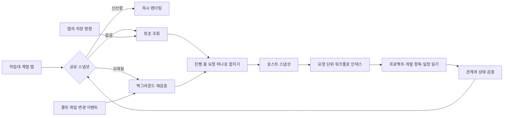

# Sawhorse: 의도에서 운영까지 이어지는 작업대

2026-09-06. 기존 팩 중심 대시보드 위에 SDD를 호스트의 기본 도메인으로 추가한다.

## 제품 흐름

사용자는 프로젝트와 저장소 의존성을 등록하고 작업을 만든다. 각 작업은 요청에서 시작해 설계, 수행으로 이어진다(`issue-main`). 프로젝트가 `sdd-main`을 고정하면 의도, 명세, 구현, 검증, 배포를 밟는다. 이 문서의 `작업`은 저장 규약의 `WorkItem`이며, 앱 화면에서는 **개발 항목**으로 부른다 — 자동화의 자동화 작업(`TaskDef`)과 구분하기 위해서다. 용어 대응은 [앱 구조 문서](product-organization.md#용어)에 있다. 백로그·캘린더·문서·하네스가 같은 작업 ID를 사용한다. 에이전트 실행이 끝나도 작업이 자동 승인되지는 않는다. 산출물과 실제 검증 근거를 검토한 뒤 단계 전환을 기록한다.

| 단계 | 주요 산출물 | 앱이 연결하는 일 |
|---|---|---|
| Plan / 의도 | intent.md | 문제·원하는 결과·영향·제약·열린 질문 |
| Design / 설계 | spec.md | 요구사항·수용 기준·설계·우려 사항 |
| Build / 구현 | plan.md | 변경 범위·의존 저장소·작업 순서·실행 |
| Test / 검증 | verification.md | 실제 명령·결과·증거·미해결 실패 |
| Deploy / 배포 | release.md | 릴리스 내용·배포 및 되돌리기 기록 |
| Maintain / 학습 | learning.md | 관측 결과·회귀 방지·후속 의도 |

작업은 하나의 생명주기를 목록과 공정 보드로 본다. 별도의 이슈 화면과 상태 드래그는 없다. 공정 전환과 수락·종료 결정이 작업 상태를 갱신하며 중간 공정 승인은 진행 안에서 일어난다. 마지막 공정의 근거를 확인하고 결과를 인수하면 완료한다. 실행 런의 종료는 작업 완료를 의미하지 않는다.

자세한 화면·상태 계약은 [제품 구조](product-organization.md#하나의-작업-생명주기)를 따른다. 기본 경량 흐름과 프로젝트가 선택한 SDD/TDD 워크플로, 기존 작업에 고정된 버전은 유지한다. 이슈 유형·처리 유형·마일스톤·GitHub 연결은 같은 작업의 메타데이터다.

## 메모로 의도를 만드는 흐름

새 의도의 기본 입력은 제목·담당자·기한 양식 대신 자유로운 Markdown 메모와 이미지다. 기존 Atomic Editor로 라이브 편집하고 미리보기를 전환한다. 클립보드 이미지, 브라우저 파일 드롭, 데스크톱의 네이티브 파일 드롭과 파일 선택을 지원한다. 메모 없이 이미지로만 시작할 수도 있다. 제목은 첫 문장에서 만들며 프로젝트를 선택하기 전에도 메모를 저장할 수 있다.

이 입력은 `intent-flow@1.0.0`으로 저장한다. 프로젝트에 고정된 기존 SDD/TDD 항목은 유지한다. 원문은 `intent.md`, 이미지는 같은 작업 폴더의 `attachments/`에 내용 해시 이름으로 저장한다. 에이전트는 원문과 이미지를 읽고 `spec.md`에 설계·수용 기준·가정·열린 질문을, `plan.md`에 ID·범위·의존성·검증 방법이 있는 작업 단위를 작성한다. 작업 단위는 계획 문서의 체크리스트이며 별도 WorkItem을 자동 생성하지 않는다.

「설계 요청」은 저장 후 프로젝트의 기본 에이전트와 모델로 planner를 시작한다. 설계 검토 화면에서 수정 메모를 보내 보완하거나 「설계 승인하고 구현 시작」으로 implementer를 실행한다. 승인 시 화면에서 읽은 문서 digest를 검사하고 승인한 intent/spec/plan의 revision을 `approved-design.json`에 기록한다. 구현 재실행 시에도 이 세 문서가 승인 버전과 일치해야 한다. 수정이 필요하면 설계를 다시 검토하는 흐름으로 돌아간다. 구현 에이전트는 승인한 작업 단위를 구현하고 검증·수정까지 수행하며 실제 결과를 `verification.md`에 기록한다. 실행 종료 신호만으로 성공을 선언하지 않으며 결과 확인 후 완료할 수 있다.

저장 실패는 부분 생성 폴더를 정리하고, 동일 요청 ID의 재시도는 같은 원문인 경우 기존 항목을 반환한다. 실행 실패는 의도나 승인을 지우지 않으며 화면에서 다시 실행할 수 있다. 브라우저 체험은 저장·검토만 제공하고 실제 에이전트 실행은 명시적으로 거절한다.

## 저장 규약

```text
<vault>/
  .sawhorse/schema.json
  projects/<project-id>/project.md
  work/<work-id>/
    work.md
    intent.md
    spec.md
    plan.md
    verification.md
    release.md
    learning.md
  calendar/<event-id>.md        # kind: milestone 이 마일스톤이다
  프로젝트/<프로젝트명>/          # 사람이 읽는 문서. 예전 이름 사업/ 도 읽는다
  runs/<run-id>.md
```

YAML frontmatter는 관계와 상태, 본문은 사람이 읽는 기록이다. ID는 표시 제목과 분리한다. 저장소 경로와 프로젝트 관계는 프로젝트 문서가 소유한다. 단계와 판단 이력은 앱이 변경한다. 문서 본문은 앱과 에이전트가 편집할 수 있으며 앱 저장은 SHA-256 revision 비교로 외부 수정 충돌을 감지한다. 앱 재시작 후에도 원본 Markdown에서 다시 읽는다.

새 규약은 버전이 있는 필수 코어다. 초기화는 멱등이며 기존 SI/기록 폴더를 삭제하거나 이름을 바꾸지 않는다. 과거 확장은 계속 쓸 수 있지만 코어 필드를 재정의하지 않는다. 향후 스키마 변경은 명시적 버전 마이그레이션으로 처리한다. 현재 버전보다 새로운 스키마를 발견하면 쓰기를 거부한다.

## 읽기 모델과 화면 갱신

Markdown은 계속 정본이지만 화면마다 같은 파일을 처음부터 다시 읽지는 않는다. 작업대 계열 화면은 하나의 공유 스냅샷을 읽기 모델로 사용한다. 탭을 옮길 때는 캐시를 즉시 그리고, 볼트 변경이나 오래된 캐시의 재진입만 백그라운드 갱신을 시작한다.



공유 스냅샷은 영속 캐시가 아니며 앱을 다시 열면 Markdown에서 재구성한다. 앱에서 저장한 뒤에는 완료된 명령이 강제 갱신을 기다리고, 외부 편집은 재귀 파일 watcher 이벤트가 갱신한다. watcher를 놓친 경우를 위해 화면 재진입 시 30초가 지난 캐시를 재검증한다. 같은 시점에 여러 화면이나 개발 모드의 이중 mount가 조회를 요청해도 진행 중인 요청 하나를 함께 기다린다. 고정 주기의 전체 폴링은 하지 않는다.

호스트는 스냅샷 요청 시작 시 활성 워크플로 정의와 digest를 한 번 읽어 메모리 인덱스로 만든다. 프로젝트와 개발 항목 목록 작성, 산출물 확인, 관계 검증은 모두 이 인덱스를 공유한다. 항목 수만큼 카탈로그 디렉터리를 다시 순회하거나 같은 정의의 digest를 반복 계산하지 않는다. 이 인덱스는 요청 안에서만 유효하므로 외부에서 워크플로 정의를 바꾸면 다음 스냅샷이 새 내용을 읽는다.

## Herdr 실행 하네스

Tauri는 Herdr CLI를 통해 에이전트를 시작하고 관측한다. 프로세스를 UI 수명에 묶지 않는다. 각 실행은 작업, 프로젝트, 단계, 역할, 모델, 부모 실행, Herdr 세션과 pane/agent identity를 기록한다. 앱은 실행 시작 전에 기록을 만들고, 시작 실패·승인 대기·검토 대기·중지 상태를 보존한다. 프롬프트에는 정확한 산출물 위치, 프로젝트 관계, 검증 명령을 넣는다.

독립된 연구·계획·구현·검증·검토 역할로 실행한다. 부모 실행에서 하위 실행을 요청할 수 있고, 요청 수용 여부와 결과는 기록으로 남는다. Herdr의 idle/done은 에이전트가 입력을 기다린다는 신호다. 테스트 통과나 배포 완료의 증거로 취급하지 않는다. 앱이 소유한 실행의 정확한 identity를 확인한 후에만 중지 등 제어 명령을 보낸다.

일을 마친 터미널 화면은 남기지 않는다. 실행이 검토 대기로 가라앉으면 마지막 출력을 기록과 트랜스크립트에 갈무리한 뒤 그 실행의 Herdr 탭과 전용 workspace를 닫는다. 닫힌 뒤에도 사람에게 필요한 것은 화면이 아니라 최종 보고와 세션 id이며, 둘 다 실행 기록에 남는다. 무엇을 닫을지는 대시보드의 `herdr.cleanup` 설정이 정한다. `keep`은 아무것도 닫지 않고, `closeOnSuccess`는 검토 대기만, 기본값 `closeAlways`는 실패·중지까지 닫는다. 실행 중이거나 승인 대기인 화면은 어떤 설정에서도 닫지 않는다. 소유권을 확인하지 못한 pane도 닫지 않는다. 우리 것이라고 증명하지 못한 화면을 지우지 않기 위해서다.

닫힌 실행은 「Herdr에서 이어하기」로 되살린다. 기록된 세션 id를 에이전트 CLI에 `--resume`으로 넘겨 같은 대화를 새 pane에 다시 붙이고, 실행 기록은 새 workspace/tab/pane에 다시 묶인다. 검토 화면에서 후속 지시를 보낼 때도 같은 경로로 먼저 세션을 되살린다. 세션 id를 우리가 발급한 실행만 이어할 수 있다.

현재 하네스는 실행 관리와 기록 수집을 제공한다. 임의의 운영 환경에 대한 자동 배포, 모니터링 수집, 외부 CI 정책은 프로젝트별 실행 절차가 필요하다. `release.md`를 만드는 것만으로 실제 서비스가 배포되었다고 표시하지 않는다.

## 배포와 확장

Tauri 데스크톱을 유지한다. 로컬 파일·여러 저장소·지속 터미널이 핵심이므로 웹 서비스로 바꾸는 것보다 사용자의 기존 작업환경과 자연스럽게 연결된다. 기본 SDD는 플러그인 설치 없이 앱에서 제공한다. `plugin/skills/sdd`는 앱이 시작한 에이전트가 산출물 규약을 따르도록 돕는다. SI·루틴·커넥터는 추가 기능으로 남는다. Obsidian은 같은 Markdown을 보는 선택적 클라이언트다.

Atomic Editor는 기존 React/CodeMirror 기반 라이브 Markdown 편집에 사용한다. 문서의 정본은 원문 Markdown이며 편집기 내부 모델이 별도 정본이 되지 않는다.

지식 검색은 우선 로컬 Markdown의 정확 검색과 원문 위치를 제공한다. zvec-grep는 프로젝트를 넘는 의미 검색 후보로 검토했다. 자체 인덱스 및 임베딩 관리가 필요하므로 현재 코어 저장소와 강결합하지 않는다. 이후 선택적 검색 공급자로 연결할 수 있다. 원문과 파일 경로는 계속 Sawhorse가 소유한다.

## 출처와 해석

- [Anthropic: Capture as intent.md](https://academy.claude.com/courses/ai-native-sdlc-playbook/capture-intent): 의도를 사람이 읽고 버전 관리할 수 있는 Markdown으로 구체화하고 검토한다.
- [Anthropic: Requirements and design](https://academy.claude.com/courses/ai-native-sdlc-playbook/requirements-and-design): 승인된 intent에서 spec을 만들고 구현 진입을 검토한다.
- [Anthropic: Feedback loop](https://academy.claude.com/courses/ai-native-sdlc-playbook/give-claude-a-feedback-loop): 작업 중 반복 검증과 독립 검증 역할을 구분한다.
- [Anthropic: Closing the loop](https://academy.claude.com/courses/ai-native-sdlc-playbook/closing-the-loop-on-metrics): 운영 근거가 새 의도로 돌아오는 흐름.
- [Herdr](https://herdr.dev): 지속 터미널 및 에이전트 제어 기반. 구현 시 설치된 CLI 도움말을 계약으로 확인했다.
- [Atomic Editor](https://github.com/kenforthewin/atomic-editor): Markdown 원문을 유지하는 CodeMirror 6 라이브 편집기.
- [zvec-grep](https://github.com/zvec-ai/zvec-grep): 로컬 정확·키워드·벡터 검색을 통합하는 선택적 검색 후보.

이 앱의 폴더 구조, 상태 모델, 실행 장부와 UI는 위 자료를 바탕으로 Sawhorse에 맞게 설계한 것이다. Anthropic의 공식 제품 구현이나 고정 표준을 그대로 복제한 것은 아니다. 제공된 YouTube 영상은 직접 내용을 가져오지 못해 공식 Academy 문서를 근거로 삼았다.
