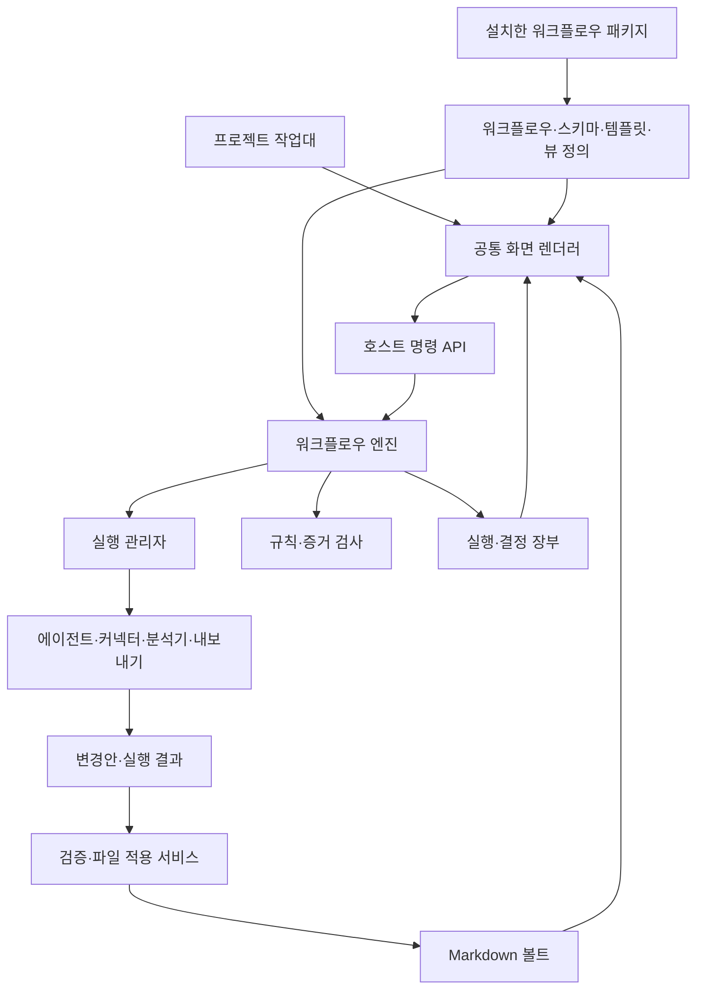
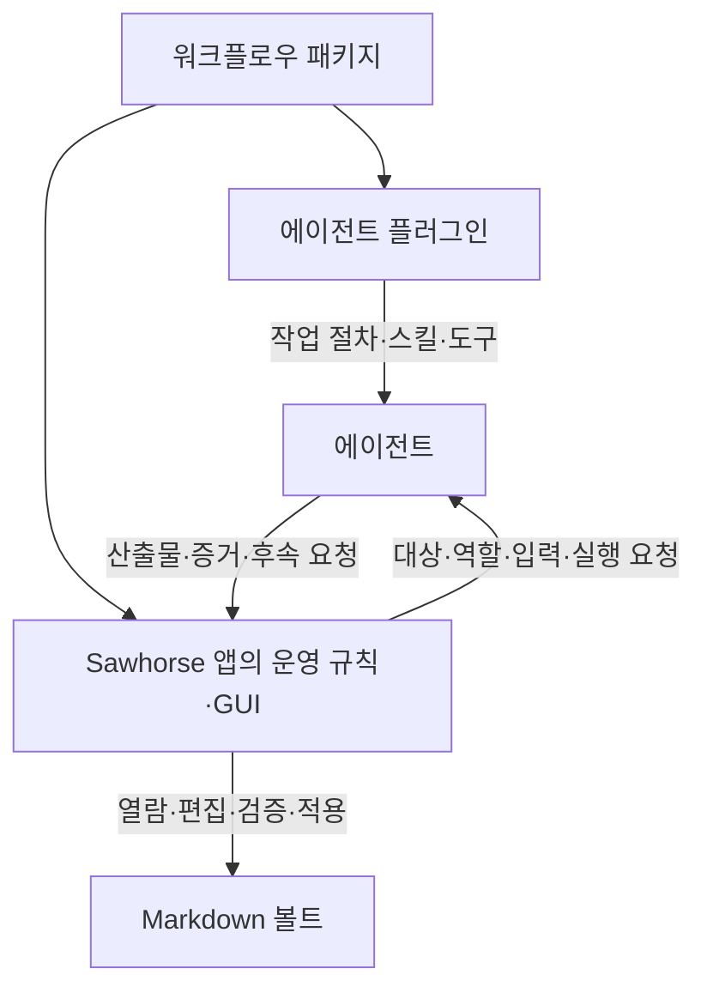
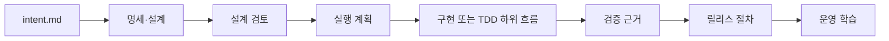
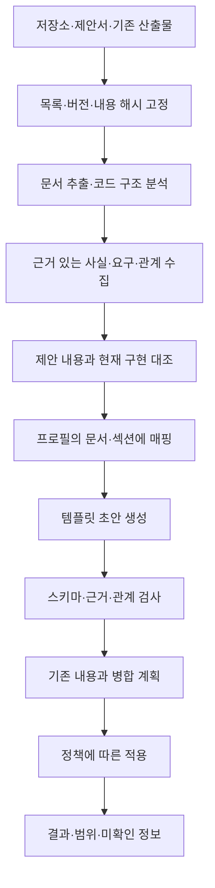

# Sawhorse 워크플로우 플랫폼 설계

작성일: 2026-09-06. 상태: 1~5단계의 로컬 MVP 구현 완료, 후속 격리·중앙 협업 범위 제외. 현재 작업 트리를 기준으로 분석했다.

## 1. 제품 방향과 결론

**Sawhorse는 팀의 일하는 방식을 설치하고, 편집하고, 실행하는 확장 가능한 작업대다.**

워크플로우 패키지를 프로젝트에 적용하면 단계, 산출물, 에이전트 행동, 검증 규칙, 운영 화면이 함께 구성된다. 기본 설치에는 `intent.md`에서 시작하는 SDD 패키지를 제공한다. TDD, SI 프로젝트 관리, 고객사 승인 절차, 연구·문서 작업도 같은 엔진에서 실행한다. SDD 안의 구현 단계에 TDD를 넣는 조합도 가능하게 한다.

구현 가능하다. 현재 React/Tauri 앱, 선언형 팩, Markdown 편집기, Herdr 실행 추적, 파일 revision 검사, 협업 장부를 재사용할 수 있다. 가장 큰 변경은 고정된 SDD 도메인을 워크플로우 정의로 옮기는 것이다. 노드 편집기는 그 정의를 편집하는 화면이며, 실행 엔진·스키마·패키지 계약을 먼저 정해야 한다.

이 설계는 기존 `sdd-workbench.md`와 `sdd-contract.md`의 “SDD와 고정 코어 스키마를 호스트가 소유한다”는 결정을 변경한다. 기존 문서는 호환 SDD 경로의 기록으로 보존한다. 이 문서의 API·파일 형식 중 아래 구현 현황에 명시한 부분만 현재 앱이 지원하며, 나머지는 목표 계약이다.

### 2026-09-06 구현 현황

- `WorkflowDefinition` 검증·카탈로그·정확한 버전/내용 digest 고정·안전한 산출물 경로 해석과 실제 실행 엔진을 사용하는 시뮬레이터를 구현했다. 내장 정의는 `sdd-main@1.0.0`, `tdd-cycle@1.0.0`, `sdd-with-tdd@1.0.0`이며 SDD의 하위 TDD 진입·반복·복귀를 같은 엔진에서 실행한다.
- 프로젝트가 워크플로우를 선택하고 새 작업이 그 정의와 digest를 고정한다. 작업대의 단계·산출물·역할·전환은 정의에서 읽고, 기존 `sdd_*` API도 runtime instance가 생긴 뒤에는 공통 장부를 우회하지 않는다. SQLite 장부의 instance, node run, event, stale attempt, 하네스 실행 참조를 작업 상세에서 확인할 수 있다.
- Workflow Studio에서 노드 종류, 산출물 계약, 하위 워크플로우, 역할, 연결, 입력/출력, 템플릿을 편집하고 검증·가상 실행·초안 저장·불변 버전 발행·JSON 내보내기를 할 수 있다. TDD 에이전트 절차는 [`plugin/skills/tdd/SKILL.md`](../../plugin/skills/tdd/SKILL.md)로 분리했다.
- `VaultSchema`의 문서 타입·필드·별칭·기본값·경로·템플릿을 Schema Studio에서 편집한다. 전체 Markdown/frontmatter scan 뒤 필드 rename/default, 경로 이동, wiki/Markdown 링크 수정을 하나의 `ChangeSet`으로 계획한다. 외부 편집, symlink, 경로 탈출, 대상 충돌을 차단하며 journal 복구와 안전한 rollback을 제공한다. 새 schema revision 발행과 활성 pointer 변경은 적용 후 재검증이 성공해야만 가능하다.
- 확장 manifest v2는 실제 semver 의존성, 엔진 API 범위, 전체 payload digest, 기여, 프로젝트별 명시 권한을 검사한다. 로컬 폴더/portable 파일/정확한 Git commit/HTTPS 설치, 의존성 충돌 진단, 불변 저장소, 프로젝트 lock, 바이너리 보존 package 내보내기를 제공한다. 표·보드·폼·문서·타임라인·검토 목록·그래프·지표 선언형 view를 공통 renderer가 표시한다.
- XLSX는 [`plugin/extension-packages/xlsx-export`](../../plugin/extension-packages/xlsx-export) 선택 확장으로 분리했다. 기본/SI 화면과 설정에는 XLSX 진입점이 없고, 기존 job 기록을 읽기 위한 호환 분기만 남겼다. 번들 package digest는 CI에서 검사한다.
- 프로젝트 가져오기는 여러 로컬 입력을 exact digest snapshot으로 고정하고 `.sawhorse/runtime.sqlite`에 파일 단위 checkpoint를 기록한다. 일시정지·재개·취소·자동 적용, 내용 주소 기반 evidence, 범위/구조/추적 문서 초안, 동일 입력 중복 방지, 기존 사람 문서 충돌 보존, 이전 생성본 기반 갱신을 제공하며 적용은 공용 `ChangeSet`을 사용한다.

이 완료 표시는 이 문서의 1~5단계에 정의한 **로컬·선언형 MVP**를 뜻한다. 병렬 fork/join, 신뢰하지 않는 제3자 native 코드와 임의 custom UI의 강제 격리, 원격 CI 승인 서비스, 분산 인증·실시간 공동 편집·중앙 감사 서버는 표의 `후속` 범위로 남는다. PDF/DOCX/OCR의 의미 추출도 설치형 analyzer 계약을 위한 자리만 제공하며 기본 설치가 내용을 해석한다고 주장하지 않는다.

### 2026-09-08 워크플로우 조합과 확장 의존성 개선

- 레지스트리는 하위 정의 자체의 유효성, 누락된 정확한 버전, 같은 ID·버전의 내용 충돌, 직접·간접 순환 참조를 검사한다. Studio 검증에서도 저장된 하위 흐름을 확인하며 시뮬레이션 실패의 경로와 이유를 화면에 표시한다. 시뮬레이션의 편집 중인 루트 정의는 해당 발행 버전 대신 사용하지만 저장된 정의를 변경하지 않는다.
- 워크플로우 버전은 확장 패키지와 동일한 SemVer 파서로 검사한다. prerelease·build metadata는 허용하고, 경로 구분자가 섞인 버전이나 `.`·`..` ID는 파일을 만들기 전에 거부한다.
- 확장의 모든 워크플로우를 먼저 함께 검증하고 자식부터 발행한다. 패키지 ID 정렬이나 manifest의 파일 순서에 의존하지 않으며, 같은 버전·내용의 재적용은 멱등적이다.
- 확장 의존성은 최신 버전부터 탐색하되 뒤에서 충돌하거나 하위 의존성이 없으면 앞선 선택을 되돌려 다른 설치 버전 조합을 찾는다. 필수 의존성을 먼저 반환하고 선택 의존성은 자동으로 활성화하지 않는다. 같은 ID·버전의 상이한 digest는 임의 선택하지 않으며, 탐색은 128개 패키지·10,000회 후보 시도로 제한한다.
- 활성화는 한 번 읽은 설치 목록을 사용하며, 기존 프로젝트 lock과 합친 결과의 모든 필수 의존성과 정확한 digest를 변경 전에 확인한다. 기존 확장을 깨뜨리는 조합, 손상된 profile, 잘못된 contribution은 발행·lock 변경 전에 실패한다. 다른 프로젝트의 lock과 profile의 사용자 필드는 유지한다.

이 검증은 활성화 전체를 파일시스템 트랜잭션으로 바꾸지는 않는다. 실제 쓰기 중 I/O 오류가 발생하면 이미 발행된 유효한 불변 revision이 남을 수 있으며 재시도로 이어간다. 기존 확장을 유지할 수 없는 의존성 업데이트는 오류에 나온 요구 범위를 보고 호환 버전을 선택해야 한다.

회귀 검증은 임시 볼트에서 부모 우선 manifest·여러 패키지 조합, 공통 의존성 버전 재탐색, 순환 참조, 실패 시 기존 lock/profile 보존을 확인한다.

### 사용자가 요청한 기능과 설계의 연결

| 요구 | 설계 |
|---|---|
| 워크플로우에 따라 GUI와 에이전트 작업이 바뀜 | Workflow Definition + UI Contributions + Agent Context |
| 기본 SDD, TDD와 회사별 방식 지원 | 기본 SDD 패키지, 추가 패키지, 하위 워크플로우 |
| GUI로 편집하고 다운로드해서 적용 | 단계 편집기/노드 편집기, 버전 있는 확장 설치·프로젝트 적용 |
| 팀 구성원이 공통 방식으로 작업 | 공유 프로필·버전 고정·정책 검사, 필요 시 원격 CI 검증 |
| 볼트 폴더·필드·템플릿 편집 | Schema Studio와 ID 기반 문서 연결 |
| 변경된 스키마에 맞춰 볼트 자동 정리 | 검사 → 변경 계획 → 적용 → 검증·복구 |
| 엑셀 등은 필요한 사용자만 설치 | 독립 Exporter 확장과 기여 메뉴 |
| 기존 코드·제안서·산출물을 넣어 자동 문서화 | 재개 가능한 프로젝트 가져오기 워크플로우와 근거 기반 템플릿 채우기 |

## 2. 현재 코드에서 확인한 기반과 간극

| 영역 | 현재 확인한 구현 | 필요한 변경 |
|---|---|---|
| SDD 모델 | [`types.ts`](../../app/src/features/workbench/types.ts)의 `STAGES`, `ARTIFACTS`와 Rust의 동일 상수 | 단계·문서 종류를 활성 워크플로우에서 해석 |
| 저장 | [`sdlc.rs`](../../app/src-tauri/src/sdlc.rs)의 `projects`, `work`, `calendar`, 파일명 고정 | 논리 ID → 스키마 경로 해석기로 교체 |
| 단계 전환 | `sdlc.rs::transition_at`의 인접 단계 전환과 고정 문서 게이트 | 명시된 연결·반복·하위 흐름·증거 조건 해석 |
| 실행 프롬프트 | [`sdlc_harness.rs`](../../app/src-tauri/src/sdlc_harness.rs)의 단계·역할·문서 경로 고정 | 노드별 역할·입출력·도구·검증 규칙에서 생성 |
| 작업 화면 | [`WorkbenchPage.tsx`](../../app/src/features/workbench/WorkbenchPage.tsx)의 고정 단계·문서 탭 | 공통 렌더러 + 워크플로우별 화면 기여 |
| 선언형 팩 | [`packs.rs`](../../app/src-tauri/src/packs.rs)의 폴더·설정·액션·뷰·스킬 | 워크플로우·스키마·템플릿·서비스 기여로 확장 |
| 확장 설치 | [`extensions/manifest.rs`](../../app/src-tauri/src/extensions/manifest.rs)의 별도 bundle/connector 모델 | 팩과 커넥터의 설치·버전·정책을 하나의 패키지 모델로 통합 |
| 선언형 화면 | [`PackViewPage.tsx`](../../app/src/pages/PackViewPage.tsx)의 notes 테이블 | 표·보드·폼·문서·실행 타임라인·검토 목록을 공통 렌더러로 제공 |
| 볼트 초기화 | [`workspace.rs`](../../app/src-tauri/src/workspace.rs)는 없는 폴더·파일을 생성 | 기존 파일 이동·필드 변환·링크 수정·내용 보완을 계획하고 적용 |
| 엑셀 | [`jobs.rs`](../../app/src-tauri/src/jobs.rs)의 `excel` 분기, `config.rs`, `state.rs`, `ImprovePage.tsx`, SI 팩 액션 | 설정·상태·실행·메뉴·스크립트를 독립 확장 소유로 이동 |
| 기존 자료 분석 | SI의 `project-doc`, `codebase-docs` 스킬과 기능분석 템플릿 | 범용 입력·출처·청크·체크포인트·문서 병합 서비스와 연결 |
| 실행 복구 | SDD 실행 장부, [`collab/store.rs`](../../app/src-tauri/src/collab/store.rs)의 SQLite·이벤트·file WAL | 의미가 다른 기존 실행기를 어댑터로 감싸고 공통 실행·변경 적용 계약 추출 |

팩에는 “활성 목록이 비어 있으면 전부 활성”인 호환 규칙과 사용자 팩의 내장 팩 덮어쓰기가 있다. 커넥터 bundle에는 별도의 충돌·서명 정책이 있다. 새 설치 모델은 이 차이를 명시적으로 해소해야 한다. 새 사용자의 빈 활성 목록은 아무 추가 확장도 켜지 않은 상태로 해석한다. 기존 사용자는 최초 변환 시 실제 활성 목록을 고정한다.

현재 manifest가 `wasi:` 문자열을 허용하는 것과 WASI 실행·권한 격리가 구현된 것은 다르다. 현 구조를 일반적인 제3자 코드 실행 샌드박스로 간주하지 않는다.

## 3. 코어와 확장 경계



| 코어가 제공하는 공통 능력 | 확장이 정하는 업무 내용 |
|---|---|
| 워크스페이스·프로젝트·ID·문서·관계 | 요구사항·이슈·프로젝트·회의 등 문서 종류 |
| 그래프 실행·대기·재시도·취소·복구 | SDD/TDD 단계, 반복, 진입·완료 조건 |
| 에이전트·도구 실행과 결과 기록 | 역할 프롬프트, 스킬, 검증 액션 |
| 문서 읽기·편집·검색·스키마 검사 | 필드·폴더·파일명·템플릿·내용 규칙 |
| 공통 GUI 렌더러와 화면 배치 | 메뉴, 보드 열, 폼, 단계별 패널과 액션 |
| 확장 설치·의존성·권한·버전 | XLSX 내보내기, GitHub 연결, 특정 문서 분석기 |
| 자료 수집·분석 작업·출처·변경 적용 기반 | 프로젝트 인수·등록 절차, 문서별 추출·작성 방식 |

기본 앱에는 SDD 패키지를 번들하고 최초 프로젝트의 기본값으로 선택한다. SDD도 추가 워크플로우와 동일한 공개 계약을 사용한다. 엑셀, SI, RSS 같은 기능은 필요한 사용자가 설치·활성화한다. 공통 코어에는 내보내기 제공자를 등록할 수 있는 자리만 있다.

설치 단위는 확장 패키지, 적용 단위는 프로젝트의 프로필이다. **에이전트 플러그인은 실제 일하는 절차를 에이전트에 주입하고, Sawhorse 앱은 그 워크플로우의 운영 주체가 된다.** 플러그인은 절차·스킬·템플릿·도구 사용 규칙을 공급하는 실행 측 구성이고, 앱은 프로젝트 맥락·실행 수명·산출물·판정·사용자 조작을 관리한다.

### 워크플로우 패키지·플러그인·앱의 관계

사용자에게는 하나의 워크플로우 확장으로 설치한다. 같은 패키지에 에이전트용 구성과 앱용 구성이 함께 들어 있다. 에이전트별 설치 형식으로 연결하는 어댑터는 플러그인을 전달하는 수단이다. 워크플로우의 실행 지식은 패키지에 포함된 플러그인 콘텐츠가 소유한다.

| 구성 | 역할 | SDD 예시 |
|---|---|---|
| 워크플로우 패키지 | 에이전트와 앱이 공유할 절차·스키마·템플릿·규칙의 버전 있는 정본 | SDD 단계, 스킬, 문서 양식, 검토 조건, 화면 구성 |
| 에이전트 플러그인 | 에이전트가 각 작업을 어떤 순서·기준·도구로 수행할지 주입 | intent를 읽고 spec을 작성하는 법, 구현·검증 방식, 근거 기록법 |
| Sawhorse 앱 | 프로젝트에서 절차를 운영하고 사용자의 작업·검토·문서 관리를 제공 | 단계·백로그·문서 편집, 에이전트 호출·중단·재개, 결과 확인·다음 단계 |
| 에이전트 | 플러그인과 이번 실행의 맥락을 받아 실제 작업 수행 | 코드 조사, 설계 작성, 구현, 테스트, 결과 제출 |



예를 들어 사용자가 앱에서 intent를 작성하고 `명세 작성`을 누르면, 앱은 해당 작업의 워크플로우 버전과 현재 입력을 확인하고 플러그인이 활성화된 에이전트를 호출한다. 플러그인은 명세 작성 절차를 제공하고 에이전트가 실제 spec을 작성한다. 앱은 결과를 반영하고 문서·diff·근거를 보여준 뒤 정의된 조건에 따라 검토를 기다리거나 다음 작업을 실행한다. 플러그인에 적힌 자연어 규칙을 앱의 코드에 따로 복제하지 않는다.

### 플러그인 설치와 실행 맥락 주입은 구분한다

플러그인 설치는 재사용할 업무 절차를 사용할 수 있게 만드는 작업이다. 매 실행에는 작업 ID, 현재 노드·역할, 정확한 패키지 버전, 읽을 문서와 revision, 실제 산출물 경로, 사용할 도구, 허용 범위, 완료 조건, 결과를 보낼 주소를 추가로 전달한다. 폴더명을 GUI에서 바꾼 경우에도 앱의 binding 해석 결과가 이 실행 맥락에 반영된다.

실행 어댑터는 선택한 에이전트가 요청 버전과 필요한 기능을 사용할 수 있는지 확인한다. 설치만 되어 있다는 이유로 모든 실행에 자동 주입됐다고 간주하지 않는다. 실행별로 지원되는 로딩·호출 수단을 사용하고, 필요한 기능이 없으면 시작 전에 진단한다. 프로젝트별 패키지와 실행 맥락을 분리해 다른 프로젝트의 절차가 섞이지 않게 한다. 실행 기록에는 실제 전달한 버전·맥락을 남긴다.

앱은 워크플로우의 경계와 상태를 관리한다. 노드 내부의 조사·수정·테스트 반복은 플러그인에 따라 에이전트가 수행할 수 있다. 노드 하나를 도구 호출 하나로 제한하지 않는다. 중간 결과를 별도로 관리해야 하는 팀은 해당 과정을 하위 워크플로우로 펼친다. 에이전트는 추가 조사·재시도·다음 작업을 요청할 수 있고 앱 런타임이 정의된 규칙과 실행 범위에 따라 수락한다.

### 운영 권한은 앱의 공통 런타임에 둔다

여기서 앱은 GUI와 이를 받치는 로컬 런타임을 포함한다. 실행·스케줄·문서 적용·단계 전환의 정본은 런타임에 두고 GUI는 같은 명령 API로 조작한다. 에이전트 플러그인도 bridge 도구를 통해 현재 작업 조회, 산출물 제출, 검증 요청, 다음 단계 요청을 할 수 있다. GUI와 플러그인이 서로 다른 상태 전환 로직을 갖지 않는다.

GUI를 닫았을 때의 지속 실행은 런타임의 수명 정책으로 정한다. 초기에는 기존 실행의 추적·재연결을 유지하고, 새 작업을 계속 자동 배정하려면 트레이/백그라운드 런타임이 살아 있어야 한다. 화면이 꺼진 것과 운영 런타임이 종료된 것을 구분한다.

플러그인만 사용하는 경로도 가능하다. 런타임에 연결하면 터미널에서 시작한 작업도 같은 실행 장부에 등록한다. 런타임 없이 문서·코드를 작성한 경우 앱은 이후 외부 변경으로 발견해 검사·가져오기를 수행하며, 추적되지 않은 실행을 승인·검증 완료로 자동 기록하지 않는다.

볼트 구조 적용, 자료 분석, 내보내기 등도 앱에서 시작하고 결과를 관리한다. 에이전트 판단이 필요한 동작에는 해당 플러그인 절차로 에이전트를 호출하고, 파일 이동·형식 변환처럼 정해진 동작은 확장의 도구를 직접 실행할 수 있다. 모든 확장 동작에 에이전트 호출을 필수로 넣지 않는다.

## 4. 핵심 모델과 정본

| 개념 | 책임 |
|---|---|
| `ExtensionPackage` | 배포자·버전·내용 해시·의존성·기여·권한의 불변 묶음 |
| `WorkflowDefinition` | 입력 계약, 노드, 연결, 반복, 산출물, 게이트, 기본 화면 |
| `VaultSchema` | 문서 종류·필드·관계·경로·템플릿과 검사 규칙 |
| `ProjectProfile` | 사용할 워크플로우, 스키마, UI, 정책, 액션의 조합 |
| `WorkflowBinding` | 워크플로우가 요구하는 논리 역할을 해당 프로젝트의 문서 타입·필드·액션에 연결 |
| `WorkflowInstance` | 특정 작업이 선택한 정확한 정의·프로필·스키마 revision과 현재 실행 상태 |
| `NodeRun` | 실행 시도, 입력 revision, 출력, 증거, 비용, 부모 실행, 반복 횟수 |
| `ChangeSet` | 파일별 예상 기존 hash, 생성·이동·수정 내용, 출처, 충돌, 적용 상태 |

`ArtifactType`은 문서 종류, `Artifact`는 실제 문서, `ArtifactRevision`은 특정 내용 버전이다. 게이트는 “검증 문서가 있다”를 넘어 어떤 입력·코드 revision에 대한 어떤 증거가 있는지 검사한다.

작업에는 세 가지 상태가 공존한다. 업무 상태는 담당자·백로그 관리에 쓰고, 워크플로우 상태는 현재 활성 노드들을 나타내며, 실행 상태는 프로세스·도구 실행 상태다. 보드 상태를 바꾸거나 에이전트가 idle이 되어도 워크플로우 게이트가 통과되지는 않는다. 업무 상태의 이름과 열도 프로필에서 편집하고, 집계를 위한 선택적 공통 분류만 매핑한다.

### 저장 책임

- 사용자가 관리하는 문서 내용·업무 필드는 Markdown/YAML이 정본이다. 설정·정의는 버전 있는 JSON 파일이 정본이다.
- 실행 시도·이벤트·결정·적용 journal은 SQLite가 정본이다. 검색 인덱스와 화면 projection만 재생성 가능한 캐시다. 실행 DB를 지워도 된다고 안내하지 않는다.
- Markdown에 보여주는 실행 요약은 장부에서 만든 읽기용 기록이다. 이 요약이나 사용자가 수정한 frontmatter가 승인·검증 증거를 대체하지 않는다.
- 백업/이동에는 문서·정의·사용 중 패키지 잠금·실행 DB와 증거를 함께 포함한다. 기본 Markdown 사용에 외부 서비스는 필요하지 않다.
- 실행 DB·staging·로컬 증거 캐시는 기기별 데이터다. 실행 중인 SQLite 파일을 Git이나 폴더 동기화로 공동 편집하지 않는다. 백업은 일관된 DB snapshot을 만들고, 다른 기기에서 가져온 실행은 기존 프로세스를 재실행하지 않는 이력으로 취급한다.

```text
<vault>/
  .sawhorse/
    workspace.json              # 활성 스키마 revision, 저장 형식 버전
    extensions.lock.json        # 패키지와 의존성의 정확한 버전·내용 해시
    profiles/<id>.json          # 프로젝트에 적용할 구성
    schemas/<id>/<rev>.json     # 공개한 불변 스키마
    workflows/<id>/<rev>.json   # 사용자 편집 후 공개한 불변 정의
    drafts/                    # 아직 적용하지 않은 편집본
    runtime.sqlite             # 실행·결정·적용 journal
    evidence/                  # 결과·출처와 내용 해시로 식별한 스냅샷
    staging/<change-set-id>/    # 적용 전 결과
  프로젝트/...                 # 아래의 사용자 문서 경로는 모두 변경 가능
  작업/...
  일정/...
  지식/...
```

`.sawhorse`는 내부 메타데이터 영역으로 예약한다. 사용자가 다루는 문서 폴더와 파일명은 고정하지 않는다. 로컬 저장소 절대경로와 비밀정보 참조는 기기 설정에 두고, 팀 공유 프로필에는 논리 저장소 ID와 원격 주소만 둔다. 하나의 볼트에 여러 프로젝트·여러 워크플로우를 적용할 수 있으며, 프로젝트별 binding과 저장 범위를 분리한다.

## 5. 워크플로우 정의와 실행

### 정의는 프롬프트보다 구체적이어야 한다

프롬프트·문서 양식만 배포하면 앱은 다음 단계, 완료 조건, 필요한 UI를 알 수 없다. 워크플로우에는 구조화된 실행 규칙이 있어야 한다.

1차 노드 종류는 `artifact`(문서 작성), `agent`(에이전트 작업), `check`(도구 검증), `human`(결정), `condition`(분기), `subworkflow`(하위 흐름), `end`다. `artifact`는 문서 편집을 기다리거나 등록된 생성 액션을 사용할 수 있다. 모든 완료 판정은 호스트가 입력·출력 계약으로 검사한다.

노드는 안정적인 ID, 사람이 읽는 이름, 입출력, 실행자, 설정 폼, 완료 조건을 가진다. 연결은 이벤트와 조건을 선언한다. 임의 JavaScript나 셸 문자열을 조건식으로 평가하지 않는다. 조건은 호스트의 제한된 연산자와 등록된 validator로 표현한다. 조건·필드·renderer를 모르면 정의를 거부하고 편집기에 원인을 표시한다.

다음은 구조를 설명하는 발췌이며 완전한 설치 패키지는 아니다. `spec-writer`, 템플릿, 산출물 역할은 같은 패키지와 binding에서 정의한다.

```json
{
  "definitionVersion": 1,
  "id": "sdd-main",
  "version": "1.0.0",
  "entry": "intent",
  "nodes": [
    { "id": "intent", "kind": "artifact", "artifactRole": "intent", "completion": "validated" },
    { "id": "spec", "kind": "agent", "actionRef": "spec-writer", "inputs": ["intent"], "outputs": ["spec"] },
    { "id": "design-review", "kind": "human", "inputs": ["intent", "spec"], "decision": "approve-or-revise" },
    { "id": "ready", "kind": "end" }
  ],
  "edges": [
    { "from": "intent", "to": "spec", "on": "validated" },
    { "from": "spec", "to": "design-review", "on": "succeeded" },
    { "from": "design-review", "to": "ready", "on": "approved" },
    { "from": "design-review", "to": "spec", "on": "revise", "loopRef": "design-revision" }
  ],
  "loops": [
    { "id": "design-revision", "maxIterations": 5, "onLimit": "pause" }
  ]
}
```

### SDD와 TDD의 실제 차이



기본 SDD는 기존 의도·설계·구현·검증·배포·학습 표시를 유지하면서 내부 액션을 정의로 옮긴다. `intent.md`는 기본 파일명이다. 경로를 바꾼 프로젝트에서는 에이전트에 binding에서 해석한 실제 위치를 전달한다.

TDD는 `테스트 작성 → 의도한 이유로 실패하는지 검증 → 최소 구현 → 성공 검증 → 리팩터링 → 재검증`으로 정의한다. 실패 로그가 있다는 이유만으로 Red를 인정하지 않는다. 테스트 탐지·실행, 대상 assertion 실패, 명령/환경 오류 여부, 테스트와 코드 revision을 증거로 남긴다. Green이 실패하면 구현으로 돌아가고, 다음 테스트가 필요하면 새 반복을 시작한다. 리팩터링 이후에도 해당 테스트와 관련 회귀 검증이 통과해야 한다.

**SDD와 TDD는 함께 사용할 수 있다.** SDD의 Build에 TDD 하위 흐름을 연결하고 입력으로 승인된 명세·수용 기준, 출력으로 변경·테스트 증거를 전달한다. 독립 TDD 프로젝트도 같은 정의를 사용한다. 반복이 있으므로 전체 워크플로우를 순환 없는 그래프로 제한하지 않는다. 문서 의존성 사이클과 워크플로우의 명시적 반복은 서로 다른 검사 대상이다.

### 실행 의미와 복구

- 정의를 검증한 뒤 불변 실행 계획으로 확정한다. 에디터 좌표·확대율은 별도 메타데이터이며 실행 의미에 영향을 주지 않는다.
- 초기 실행기는 순차·조건 분기·제한된 반복·하위 워크플로우를 지원한다. 병렬 합류는 후속 단계에서 명시적 fork/join과 합류 정책을 추가한다. 처음부터 상태 저장은 단일 `stage` 문자열 대신 활성 노드 집합을 수용한다.
- 하위 흐름은 선언된 입출력만 전달하며 부모의 권한·예산 상한 안에서 실행한다. 정의의 재귀 참조는 초기에는 거부하고 깊이·전체 실행 수·시간 상한도 둔다. 하위 흐름의 실패·취소·대기 처리를 부모 연결에서 명시한다.
- `NodeRun`은 `pending / ready / running / waiting / succeeded / failed / cancelled / stale / unknown` 상태와 `attempt`, `iteration`, `inputDigest`를 가진다. 대기 이유는 사용자 입력·검토·권한·외부 결과를 구분한다.
- 실행 요청을 장부에 기록한 후 실행한다. UI가 닫혀도 추적하고, 앱 재시작 후 실행자의 identity를 확인해 재연결한다. 호스트 판단이 필요한 다음 노드는 재개 시 진행한다. 컴퓨터 절전 중 작업 진행을 보장하지 않는다.
- 이벤트는 중복 도착할 수 있다. `eventId`와 `(instanceId, nodeId, iteration, attempt)`로 중복 반영을 막는다. 네트워크 작업의 불명확한 결과는 조회·대조한 뒤 재시도하며 무조건 재실행하지 않는다.
- 입력 문서나 코드가 바뀌면 그 입력에 의존한 증거·승인을 stale로 표시하고 필요한 하위 작업만 다시 실행한다. 무효화된 증거는 이력으로 보존한다.
- 결정은 대상 revision과 정책 revision에 묶는다. 에이전트 완료는 출력 검사의 시작이다. “검증 통과”, “배포 성공”, “사람 승인”은 각각 별도 근거를 요구한다.
- 인스턴스는 시작 당시 패키지와 binding을 고정한다. 워크플로우 편집·업데이트가 실행 중인 작업을 바꾸지 않는다. 이동하려면 노드·산출물 매핑, 진행 상태, 무효화할 증거를 제시하는 인스턴스 마이그레이션을 실행한다.

## 6. 운영 GUI와 워크플로우 편집

### 일상 작업 화면

프로젝트를 열면 적용된 워크플로우 이름·버전과 다음 행동이 보인다. 사이드바와 상세 패널은 해당 프로필이 기여한 화면만 노출한다. 코어의 기본 탐색은 프로젝트·작업대·문서·실행·확장·설정으로 구성한다.

| 워크플로우 | 작업 상세에 우선 보여줄 정보 |
|---|---|
| SDD | 의도·명세·계획, 현재 단계, 검토 요청, 검증 증거 |
| TDD | 테스트 대상, 현재 반복, Red/Green 근거, 실패·회귀 목록 |
| 회사 SI | 요구사항 추적표, 산출물 현황, 결재·검수, 일정 |
| 프로젝트 가져오기 | 입력 자료, 분석 범위, 진행률, 문서 초안, 불일치·미확인 정보 |

공통 렌더러는 `table`, `board`, `form`, `document`, `timeline`, `review-queue`, `graph`, `metrics`를 제공하고 기여는 데이터 query·열·그룹·필드·액션을 선언한다. 조회는 폴더 문자열보다 artifact type/관계/논리 필드를 사용한다. 공개 SDK의 액션·이벤트·문서 API로 연결하여 화면마다 저장 로직을 만들지 않는다.

기본 선언형 GUI로 시작하고, 이를 넘어서는 제3자 커스텀 화면은 별도 격리 실행 환경과 메시지 API가 준비된 뒤 제공한다. 기존 `native: issues` 같은 연결은 이전 화면을 위한 호환 어댑터로 남기고 새 업무 로직을 추가하지 않는다.

### 편집기

일반 사용자는 단계 목록에서 순서, 이름, 담당 역할, 입력 문서, 완료 조건, 화면을 편집한다. 복잡한 흐름에는 동일한 정의의 노드 화면을 제공한다. 노드를 선택하면 오른쪽에 같은 설정 폼이 열린다. JSON 직접 편집은 고급 모드다.

편집 흐름은 `원본 복제 또는 편집 → 초안 저장 → 예제 데이터로 검증/시뮬레이션 → 버전 만들기 → 프로젝트에 적용 → 패키지로 내보내기`다. 시뮬레이션은 실제 에이전트·네트워크 액션을 실행하지 않고 누락 입력, 도달 불가 노드, 조건 누락, 반복 상한, 권한·binding 오류를 보여준다. 샘플 실행은 별도의 명시된 액션이다.

노드 캔버스 후보는 React Flow다. 커스텀 노드·연결·저장/복원 기능을 활용하고 Sawhorse의 정의 모델과 실행 엔진은 별도로 유지한다. 채택 전 현재 React/빌드 환경과 데스크톱 WebView에서의 동작을 확인한다. [React Flow 커스텀 노드](https://reactflow.dev/learn/customization/custom-nodes), [저장과 복원](https://reactflow.dev/examples/interaction/save-and-restore).

## 7. 볼트 스키마와 GUI 편집

### 문서의 의미와 파일 위치를 분리한다

문서는 안정적인 `id`, `typeId`, `schemaRevision`을 가진다. 제목·폴더·파일명·업무용 frontmatter 키는 별도 설정이다. 워크플로우의 `requirement`, `verification` 같은 역할은 binding을 통해 문서 타입에 연결하고, 코드에 `프로젝트/*/이슈` 같은 경로를 넣지 않는다.

예를 들어 화면의 `이슈 → 요청`, 실제 폴더 `프로젝트 → 프로젝트`, 파일명 규칙 `{id}.md → {slug}-{id}.md`, frontmatter 키 `status → 진행상태`를 각각 바꿀 수 있다. 관계는 문서 ID로 저장한다. 일반 Markdown/위키링크는 현재 경로로 렌더링하고 이동 시 함께 수정한다. ID가 없는 기존 문서는 마이그레이션에서 부여한다.

코어가 유지하는 식별·revision 메타데이터의 의미는 고정한다. 사용자 필드에는 내부 field ID와 실제 frontmatter key를 따로 둔다. required 여부, enum, 기본값, 관계 대상, 템플릿 섹션은 스키마로 관리한다. 여러 프로젝트가 한 볼트에 있을 때 타입 ID에는 패키지/프로필 범위를 적용해 충돌을 막는다.

Schema Studio는 폴더 트리와 문서 종류 목록을 왼쪽에, 선택한 타입의 필드·관계·템플릿·파일명 폼을 오른쪽에 보여준다. 하단에는 예제 문서의 실제 경로·frontmatter·본문과 영향을 받는 문서 수가 나온다. 스키마 초안 저장은 볼트 파일을 바꾸지 않는다.

아래는 Sawhorse 스키마 래퍼의 예다. `fields`, `storage`, `body`는 Sawhorse의 제안 계약이며 JSON Schema 표준 키워드가 아니다.

```json
{
  "schemaFormatVersion": 1,
  "id": "team-vault",
  "revision": 3,
  "types": [
    {
      "id": "team-vault.issue",
      "label": "요청",
      "storage": { "path": "프로젝트/{projectId}/요청/{id}.md" },
      "fields": [
        { "id": "title", "key": "title", "label": "제목", "valueSchema": { "type": "string", "minLength": 1 } },
        { "id": "status", "key": "진행상태", "label": "상태", "valueSchema": { "enum": ["접수", "진행", "검토", "완료"] } },
        { "id": "owner", "key": "담당자", "label": "담당자", "valueSchema": { "type": "string" } }
      ],
      "requiredFieldIds": ["title", "status"],
      "body": { "templateRef": "issue-template", "requiredSectionIds": ["request", "acceptance"] }
    }
  ]
}
```

필드 값 검증에는 JSON Schema를 사용하고, 파일 배치·문서 간 관계·본문 섹션·마이그레이션은 Sawhorse 서비스가 검사한다. `$id`/`$ref`로 재사용할 값 스키마를 식별하고 의존 패키지에 포함된 로컬 스키마 레지스트리에서 해석한다. 스키마 참조를 임의의 네트워크 fetch로 연결하지 않는다. [JSON Schema의 식별과 참조](https://json-schema.org/understanding-json-schema/structuring).

템플릿의 섹션도 안정적인 ID와 표시 제목을 분리한다. 작성 규칙에는 섹션의 목적, 요구 출처, 표 형식, 기존 사용자 내용 보존 방식, 미확인 정보 표시법을 넣는다. 스키마와 템플릿을 업데이트해도 기존 본문을 초기 양식으로 덮지 않는다.

### 검사·정리·적용

버튼 이름은 **구조 검사**, **에이전트로 보완**, **변경 적용**을 사용한다. “싱크”는 원격 동기화와 구분하기 어렵다. 사용자가 한 번에 진행하고 싶으면 범위와 자동 적용 규칙을 정한 `검사 후 적용` 작업을 시작할 수 있다.


결정적으로 처리 가능한 작업은 호스트가 수행한다. 폴더·파일 이동, 명시적 enum 매핑, 기본값 추가, 알려진 링크 변경은 코드가 계획한다. 문서 종류 추정, 자유서술 내용 분류, 새 섹션의 근거 기반 작성만 에이전트에게 맡긴다. 에이전트는 변경안을 만들고 같은 검증·적용 서비스를 사용한다.

예상 미리보기: `이동 42개 / 필드 변환 28개 / 링크 수정 91개 / 내용 보완 8개 / 충돌 3개`. 문서별 이전/이후 경로와 diff, 변환 이유, 참조한 출처를 표시한다. 분류가 불확실하거나 값 매핑이 없는 문서는 질문/보류 목록에 남긴다. 임의의 값을 넣어 스키마 통과만 시키지 않는다.

적용 프로토콜:

1. 현재 스키마 revision, 대상 문서·링크 파일의 hash, 대상 경로 존재 여부, 루트 identity를 기록한다. 변경 계획을 불변 `ChangeSet`으로 저장한다.
2. 적용 범위의 호스트 실행·쓰기를 잠시 멈추고 충돌하는 에이전트 실행은 정지 지점에 도달시킨다. 외부 편집기는 잠글 수 없으므로 쓰기 직전에도 파일별 revision을 재검사한다.
3. 백업과 파일별 의도·이전 내용·목표 hash를 journal에 남기고, staging 결과를 먼저 검사한다. 대소문자·유니코드 정규화·예약 파일명·경로 충돌·symlink 이탈도 검사한다.
4. 예상 hash가 같은 파일만 임시 파일과 rename으로 반영한다. 파일 여러 개의 변경은 단일 원자 연산이라고 가정하지 않는다. 작업 journal로 적용·복구 진행 상태를 추적한다.
5. 중단 후에는 이미 적용된 결과를 hash로 대조해 이어서 수행하거나 복구한다. 되돌리기도 적용 이후의 외부 수정을 검사하며, 달라진 문서는 자동으로 덮지 않고 충돌로 남긴다.
6. 전체 검증과 인덱스 갱신 후 활성 스키마 포인터를 마지막에 교체한다. 실패/충돌 중에는 변경 범위를 유지보수 상태로 두고 새 스키마 쓰기를 허용하지 않는다.

외부 편집과의 완전한 다중 파일 트랜잭션은 보장할 수 없다. 검사와 파일 교체 사이의 경합도 검증 대상으로 삼고, 플랫폼별 교체 방식으로 보존한 이전 파일·journal·사후 hash를 대조해 예상하지 못한 버전을 복구 가능한 충돌로 남긴다. 단순한 “hash 확인 후 rename”만으로 동시 편집 문제가 해결되었다고 보지 않는다.

위키링크·Markdown 링크·첨부 참조 등 지원하는 형식의 이동 대상을 검사한다. 임의 코드블록 안 경로나 외부 시스템 링크까지 수정했다고 주장하지 않고 진단에 남긴다. 볼트의 관리 대상 밖 일반 문서는 유지한다. 삭제·타입 축소에는 별도 매핑이나 보존 위치가 있어야 한다.

처음부터 모든 파일을 새 폴더로 이동할 필요는 없다. 기존 경로를 표현하는 스키마를 먼저 적용하면 파일 이동 없이 ID·binding 기반으로 전환할 수 있다.

## 8. 패키지 설치·조합·회사 배포

### 하나의 배포 형식

기존 `extension.json`을 다음 major 형식으로 발전시키고, `pack.json`은 호환 입력으로 변환한다. `workflow`, `schema`, `template`, `view`, `action`, `connector`, `analyzer`, `exporter`는 같은 패키지의 기여 종류다. 새로운 세 번째 독립 레지스트리를 만들지 않는다.

```text
team-workflow/
  extension.json
  workflows/development.json
  schemas/vault.json
  templates/*.md
  views/*.json
  actions/*.json
  skills/*/SKILL.md
  migrations/*.json
  tests/scenarios/*.json
```

Manifest에는 패키지 ID/배포자, 버전, manifest·engine API 범위, 필수/선택 의존성, 제공 계약, 기여 파일, 요청 권한, 파일별 digest를 기록한다. 내용 전체를 포함하는 검증 가능한 digest 목록을 서명한다. 현재 manifest 서명만 확인하는 경로를 전체 묶음 무결성 검증으로 확장한다. 개발 중인 로컬 패키지는 명시적 개발 모드로 식별한다.

패키지 ID와 내부 기여 ID를 분리한다. 초기에는 기존 하이픈 기반 패키지 ID를 유지하고 `(packageId, contributionId)` 조합으로 기여를 식별할 수 있다. 버전 비교는 기존 major만 보는 로직 대신 실제 범위 해석과 의존성 충돌 진단을 제공한다.

설치 소스는 로컬 폴더/파일, 정확한 commit에 고정한 Git 저장소, HTTPS 다운로드부터 시작한다. GitHub 브랜치 이름·태그만으로 재현성을 보장하지 않는다. 사내 레지스트리는 같은 설치 계약을 제공하는 추가 소스다. 공개 마켓 서버 없이도 회사가 패키지 파일이나 내부 URL을 공유할 수 있다.

`다운로드 → 무결성/호환성/의존성 검사 → 설치 → 프로젝트 적용`을 구분한다. 설치 중에는 스킬·스크립트를 실행하지 않는다. 압축 해제 경로 이탈과 symlink를 검사하고, 사용할 버전은 lockfile로 고정한다. 업데이트는 변경된 규칙·템플릿·권한·마이그레이션 영향을 보여준 후 프로젝트별로 적용한다.

프로필은 기반 워크플로우와 optional 하위 흐름, 스키마 binding, UI 구성, 팀 정책을 묶는다. 프로젝트별로 여러 독립 워크플로우를 제공할 수 있고 작업 생성 시 선택한다. “SDD+TDD”처럼 한 작업 안에서 연결해야 할 때만 명시적 하위 흐름으로 구성한다. 서로 다른 패키지의 단계들을 자동으로 섞지 않는다.

### 확장 권한과 실행

선언형 확장은 호스트가 해석한다. 파일 쓰기, 원격 호출, exporter 실행 같은 효과는 프로젝트 범위의 명령 API를 거친다. 에이전트도 해석된 실제 문서 위치·입출력·권한·정책을 전달받는다. 스킬만으로 호스트 게이트를 우회할 수 없다.

확장이 실행 코드를 제공하려면 실제로 강제 가능한 경계를 제공해야 한다. 초기에는 호스트가 등록한 실행 어댑터와 신뢰된 선택 확장으로 범위를 한정하고, 일반 제3자 코드 확장은 WASI 등 실행 환경의 파일/네트워크/자원 제한 검증 후 연다. 별도 프로세스나 Tauri의 frontend capability만으로 임의 native 코드·에이전트 CLI 전체가 격리된다고 보장하지 않는다. Tauri 문서도 Rust 코드 내부의 우회 등을 보호 범위 밖으로 설명한다. [Tauri capability의 보안 경계](https://v2.tauri.app/security/capabilities/).

### 엑셀의 독립성

`xlsx-export` 확장이 테이블/쿼리 결과를 입력으로 받고 파일 결과를 반환한다. 메뉴, 열 매핑 GUI, 출력 폴더, 템플릿, 실행 의존성, 마지막 출력 상태는 모두 확장 소유다. SI 특화 “개선수정사항 체크리스트”는 이 exporter 위의 보고서 프로필로 제공한다. SDD와 기본 SI 패키지에 필수 의존성으로 넣지 않는다.

설치하지 않으면 엑셀 버튼·설정·관련 런타임 의존성이 노출되거나 설치되지 않는다. 기존 엑셀 잡은 읽을 수 있게 유지하고 새로운 실행은 `extension.action`으로 보낸다. 같은 구조로 PDF 보고서, CSV, 고객사 양식 확장을 추가할 수 있다.

확장 제거 시 새 실행·화면 기여를 중지하되, 이를 참조하는 프로젝트와 진행 중 작업을 먼저 표시한다. 진행 중 작업은 종료 또는 유지 여부를 결정할 때까지 사용 버전을 보존한다. 원본 Markdown과 과거 결과를 삭제하지 않고, 사라진 renderer 대신 코어 문서 뷰와 실행 이력을 제공한다.

### 회사 공통 워크플로우

회사는 워크플로우·스키마·템플릿·필수 확장·정책이 들어간 프로필을 배포한다. 구성원은 Sawhorse 설치 후 “팀 프로필 적용”으로 같은 구성을 받는다. 필수 정책과 사용자가 수정할 수 있는 폴더/레이아웃/개인 설정을 구분하며, 로컬 변경으로 필수 정책을 약화시키는 조합은 프로젝트에서 거부한다. 정상 변경은 회사 프로필의 새 버전으로 배포한다.

회사 규칙의 **공유**와 **강제**는 보장 수준이 다르다. 로컬 앱은 다음 행동을 안내하고 호스트 API 진입을 검사할 수 있지만, 사용자가 다른 도구로 코드를 수정하거나 로컬 데이터를 바꾸는 것까지 막을 수는 없다. 강제가 필요하면 CI/서버가 코드 commit·정책 버전·검증 결과·승인 주체를 직접 확인해야 한다. 로컬 `approved: true` 값을 신뢰하는 CI는 의미가 없다.

GitHub를 사용한다면 ruleset과 필수 검사로 연결하는 구성을 제안한다. ruleset에는 적용 범위와 우회 권한이 있으므로 실제 보장은 조직 설정에 달려 있다. [GitHub ruleset](https://docs.github.com/en/repositories/configuring-branches-and-merges-in-your-repository/managing-rulesets/about-rulesets). 원격 통합은 선택 확장으로 두고, 분산 사용자 인증·실시간 공동 편집·중앙 감사 서버는 별도 후속 범위로 계획한다.

## 9. 기존 프로젝트 가져오기와 자동 문서화

이 기능 자체를 `프로젝트 가져오기` 워크플로우로 제공한다. 코어는 입력 자료, 분석 실행, 출처, 문서 변경안을 관리하고 워크플로우는 어떤 문서를 어떤 템플릿으로 채울지 정한다. SDD/회사 프로필 모두 이 서비스를 호출할 수 있다.

### 사용 흐름

1. 프로젝트 이름과 적용할 프로필을 선택한다.
2. GitHub/Git 주소 또는 로컬 워크스페이스를 연결한다. 여러 저장소와 제안서·과거 산출물·현재 문서를 함께 추가한다. Git 접근과 GitHub 이슈/PR 접근은 별도 능력이다.
3. 자료를 빠르게 목록화하고 분석 대상, 제외 항목, 지원하지 않는 형식, 필요한 분석기를 보여준다. PDF/DOCX/OCR 등은 설치된 제공자에 따라 지원 범위를 표시한다.
4. 다음 안내와 실제 실행 범위를 보여주고 시작한다: **“코드와 문서 전체를 분석합니다. 자료량에 따라 오래 걸릴 수 있으며, 선택한 에이전트 이용 요금이 발생할 수 있습니다. 중단한 위치에서 다시 시작할 수 있습니다.”** 실행 화면에는 에이전트/데이터 전달 범위, 대상 문서, 시간·비용 한도와 적용 방식이 나온다.
5. 자동 분석과 템플릿 작성을 진행한다. 시작 시 “새 문서 자동 적용” 또는 “변경안 검토 후 적용”을 선택할 수 있다. 승인된 범위의 단계마다 반복해서 묻지 않는다. 기존 사람 문서의 충돌·근거가 없는 필수 결정만 예외로 모은다.
6. 완성 문서, 출처, 요구와 구현의 차이, 미확인 목록, 후속 작업을 보여준다. 계속 분석할 때는 변경된 자료와 영향받은 문서만 갱신한다.

### 처리 파이프라인



원격 저장소는 앱이 관리하는 checkout으로 가져와 commit을 기록한다. 로컬 저장소는 선택한 현재 파일 기준으로 읽고 HEAD와 미커밋 변경의 hash/선택 파일 snapshot을 함께 남긴다. 분석 중 원본이 변하면 해당 결과를 stale로 처리하거나 고정 snapshot으로 계속한다. 원본이 일반 디렉터리여도 파일 digest로 같은 흐름을 사용할 수 있다.

정적 분석은 언어·의존성·모듈·엔트리포인트·API·DB 모델·테스트·설정부터 파악한다. 대규모 저장소는 모듈별 작업으로 나누고 공통 분석 결과를 재사용한다. 생성물, vendor, 바이너리, 비밀 파일, 대용량 자료는 기본 제외 규칙을 보여주고 사용자가 범위를 조정할 수 있게 한다. 기록한 기준 snapshot의 대상 파일을 모두 순회했는지와 의미를 해석했는지는 별도 지표다.

테스트/빌드 실행은 정적 코드 읽기와 구분한다. 실행을 켠 경우 별도 작업 사본과 허용된 도구 범위에서 검증하고 결과를 근거로 연결한다. 문서 안의 명령문이나 코드 주석은 분석 자료로 취급하며 워크플로우·권한 지시로 실행하지 않는다.

### 무엇을 자동 작성하는가

프로필이 프로젝트 개요, 요구사항, 기능 지도, 아키텍처, API·데이터 모델, 이슈·리스크, 일정·마일스톤, 요구-구현-검증 추적표를 요청하면 해당 문서를 만든다. 모든 프로젝트에 이 문서 목록을 강제하지 않는다. 사용자 템플릿의 필드·섹션 계약이 실제 작성 대상을 결정한다.

각 정보는 `문서에 기재된 요구`, `코드에서 확인한 구현`, `실행으로 확인한 결과`, `추론`, `미확인`, `상충`을 구분한다. 발주 제안서의 “완료 예정”을 현재 완료로 옮기지 않고, 코드 존재만으로 인수·검수·운영 배포를 완료 처리하지 않는다.

예: 제안서에는 SSO가 요구되지만 코드에서는 로컬 로그인만 발견한 경우, 요구사항 문서에는 SSO 요구와 출처를, 기능 문서에는 확인한 로그인 구현을, 차이 분석에는 SSO 구현 여부 미확인을 기록한다. 범위 밖 모듈이나 외부 서비스 가능성이 있으면 “미구현”으로 단정하지 않는다.

출처에는 source ID, 문서 hash와 페이지/섹션, 저장소 commit/파일 hash와 경로·줄 범위, 추출기 버전, 분석 실행 ID를 보관한다. UI에서 원문으로 이동하고 생성 문서에도 사람이 읽을 수 있는 근거를 남긴다. 수치형 “정확도 95%” 대신 무엇을 확인했는지와 검토 상태를 표시한다.

### 장시간 작업과 재실행

분석 작업 키는 입력 digest + 분석기/워크플로우/템플릿 revision + 설정으로 만든다. 작업은 단계·자료 단위 체크포인트, timeout, 제한된 retry, 동시 실행 한도, 취소·재개를 가진다. GUI에는 처리한 파일/모듈 수, 전체 목록 중 범위, 현재 단계, 실제 사용량을 표시하고 근거 없는 완료 시각을 약속하지 않는다.

이전 생성본을 merge base로 보관해 `이전 생성본 / 현재 사용자 문서 / 새 생성본`의 3방향 병합을 수행한다. 사용자 수정이 없는 부분은 갱신하고 충돌은 모은다. 최초 가져오기나 merge base가 없는 문서는 기존 내용을 임의로 대체하지 않고 추가/검토 제안으로 처리한다. 같은 snapshot으로 재실행하면 문서·이슈·관계가 중복 생성되지 않아야 한다.

수집·작성 단계 완료와 사람이 사실을 확정한 상태는 별개다. 일부 형식을 읽지 못하거나 예산 상한으로 중단되면 완료 범위와 누락을 명시한다. 자동 생성 결과는 스키마를 만족하면서 미확인 정보를 표현할 수 있어야 한다. “모든 칸에 그럴듯한 값을 채움”을 완료 기준으로 삼지 않는다.

## 10. 구현 구조와 API 초안

기존 기술 스택을 유지하고 다음 경계로 분리한다. 경로는 목표 구조이며 파일 이동 자체가 첫 작업은 아니다.

```text
app/src-tauri/src/
  extensions/       # 공통 package registry·installer·lock·capability
  workflow/         # model·compile·runtime·gates·bindings
  artifacts/        # ID·Markdown·revision·query·path resolver
  schemas/          # type registry·validate·migration planner
  changes/          # staging·journal·apply·rollback·recovery
  runs/             # 공통 run 계약, 기존 harness/job/collab 어댑터
  ingestion/        # sources·extractors·provenance·checkpoints·merge
app/src/features/
  workbench/        # 프로젝트 운영 화면
  workflows/        # 라이브러리·단계/노드 편집·시뮬레이션
  schema-studio/    # 필드·경로·템플릿·변경 미리보기
  extensions/       # 설치·적용·버전·권한
  onboarding/      # 프로젝트 가져오기와 분석 결과
```

프론트엔드는 상태 전환을 직접 계산해 저장하지 않고 호스트가 제공한 다음 액션을 렌더링한다. 같은 검증 모델이 에디터, 실행기, CLI 검증에서 쓰이도록 한다. TS/Rust 타입은 공통 계약에서 생성하거나 계약 테스트로 동기화를 확인한다.

| API 초안 | 책임 |
|---|---|
| `extension_resolve/install/activate` | 의존성 계산·설치·프로젝트 구성 적용을 분리 |
| `workflow_validate/simulate/publish` | 초안 검사·가상 실행·불변 버전 만들기 |
| `profile_resolve` | 패키지·정책·binding을 해석한 구성과 충돌 반환 |
| `workflow_start/snapshot/command` | 인스턴스 생성·활성 노드·다음 액션·revision 조건부 전환 |
| `artifact_read/write/query` | 논리 문서 접근·CAS 저장·타입/관계 질의 |
| `schema_validate/scan/plan` | 스키마·볼트 진단과 변경 계획 생성 |
| `changeset_preview/apply/rollback` | 두 자동화 기능이 공유하는 변경 적용 경로 |
| `ingestion_start/pause/resume/cancel` | 자료 분석 작업의 수명 관리 |
| `run_events(afterCursor)` | 단계 진행·사용량·대기·결과 증분 스트림 |

모든 mutation에는 필요에 따라 request ID, 예상 revision, actor, 프로젝트 범위를 받는다. 요청한 extension/workflow의 유효 권한은 호스트가 확인한다. 초기에는 `sdd_*` 명령을 기존 호출자의 호환 wrapper로 유지하고 새 기능은 일반 API를 사용한다.

## 11. 단계별 구현과 완료 기준

기간은 구현·실험 전 수치로 확약하지 않는다. 아래 순서는 사용 가능한 결과를 계속 남기는 기준이다.

| 단계 | 구현 범위 | 사용자에게 보이는 완료 기준 |
|---|---|---|
| 1. 엔진과 기본 패키지 | ID/경로 resolver, definition/binding, 순차·분기·반복·하위 흐름, SDD 추출, 최소 TDD fixture | 앱 코드 변경 없이 SDD와 TDD를 전환하고, 기존 SDD 작업을 이어서 실행 |
| 2. 스키마와 적용 | Schema Studio, 경로/필드/템플릿 편집, scan/plan/apply/recovery | 폴더·필드 이름을 바꿔도 문서 링크와 작업을 유지하고 중단 복구 |
| 3. 설치와 화면 구성 | 통합 확장 manifest, 로컬/Git/HTTPS 설치, 프로젝트 lock, 선언형 뷰, 엑셀 분리 | 팀 패키지 적용 시 화면이 달라지고 엑셀 없는 기본 설치 사용 가능 |
| 4. 기존 프로젝트 가져오기 | 입력 snapshot, 분석기 계약, 근거 추출, 템플릿 작성, 재개·병합 | 저장소+제안서로 실제 문서를 만들고 재실행 시 사용자 수정 보존 |
| 5. 작성·배포 경험 확장 | 노드 편집기, 조합 UX, 패키지 내보내기, 사내 배포, CI 검증 연계 | 팀이 GUI에서 방식을 만들고 구성원에게 같은 버전을 배포 |
| 후속 | 병렬 fork/join, 제3자 코드/커스텀 UI 격리, 중앙 공동 작업 | 명확한 실행·권한·동기화 계약을 검증한 후 개방 |

첫 데모는 **현재 SDD 흐름을 패키지에서 읽기 → TDD 패키지로 교체 → 문서 폴더를 GUI에서 바꾸기 → 같은 작업대를 계속 사용하기**로 잡는다. 이 데모가 안 되면 다운로드 UI나 노드 캔버스를 먼저 만들어도 확장성의 핵심이 검증되지 않는다.

### 기존 데이터 전환

현재 SDD schema v1은 바로 이동시키지 않는다. 기존 폴더·파일명을 표현하는 스키마와 SDD binding을 만들고, 기존 작업을 대응하는 definition/node에 연결한다. 과거 실행·결정은 legacy 기록으로 남긴다. 문서에 실제 검증 증거가 없던 이전 작업을 새 규칙의 통과로 승격하지 않는다.

기존 SI/starter 팩은 기여 형식으로 변환하고, 이전 설정·예약 키는 읽기 호환을 둔다. `~/.claude/sawhorse` 설정은 앱 소유 데이터 디렉터리로 이행하되, 기존 어댑터가 쓰는 값과 이중 쓰기하지 않도록 단일 소유자와 호환 읽기 경로를 정한다. 사용자 수정 팩·템플릿은 자동 덮어쓰지 않고 별도 로컬 파생 패키지로 식별한다.

### 핵심 인수 시나리오

1. 앱 재빌드 없이 SDD/TDD 두 정의를 적용하고 단계·액션·문서·화면이 바뀐다. SDD의 Build에 TDD를 연결할 수 있다.
2. TDD는 테스트 탐지 실패나 빌드 오류를 Red 증거로 통과시키지 않는다. 입력 코드가 바뀌면 이전 Green의 유효성이 갱신된다.
3. 정의 업데이트 뒤 실행 중 작업은 이전 버전을 유지한다. 누락된 의존 패키지는 진단되고 조용히 다른 버전으로 대체되지 않는다.
4. 폴더·frontmatter 키 변경 후 ID·관계·문서 내용·GUI 질의가 유지된다. 외부 편집과 충돌하면 적용을 멈추고 변경한 내용을 보존한다.
5. 마이그레이션 각 단계에서 강제 종료해도 journal로 복구한다. 롤백 도중 이후 사용자 수정을 덮어쓰지 않는다.
6. 엑셀 미설치 상태에 엑셀 메뉴·설정·전용 실행 분기 의존이 없다. 설치하면 선언한 화면에서만 메뉴가 생긴다.
7. 저장소·제안서가 상충하는 입력에서 각 출처를 보존하고 완료/미구현을 단정하지 않는다. 생성 문서의 근거 링크가 고정 snapshot으로 연결된다.
8. 분석 중단·재시작과 동일 입력 재실행에서 문서·관계·실행 결과가 중복되지 않는다. 원본 변경 시 영향 있는 결과만 다시 계산한다.
9. 두 프로젝트가 다른 폴더·워크플로우를 사용하는 볼트에서도 ID·binding·상태·권한이 섞이지 않는다.
10. 외부 자료 안의 실행 지시가 설치·분석·검증 권한을 확장하지 않는다. 승인 요약 문서 편집만으로 호스트 또는 원격 검증을 통과하지 않는다.

## 12. 확정할 기본값과 후속 실험

구현 시작 기본값은 로컬 Tauri/React 유지, Markdown 문서 유지, 기본 SDD를 동일 계약의 번들 패키지로 제공, 프로젝트별 버전 고정, 선언형 GUI 우선, 볼트 적용과 가져오기에 같은 ChangeSet 서비스 사용이다.

후속 실험은 세 가지다. 실제 SI 볼트로 링크·한글 경로 마이그레이션을 검증하고, 대표 저장소+제안서로 문서 추출·누락률·비용을 측정하며, 격리 환경에서 exporter와 에이전트의 권한을 어디까지 강제할 수 있는지 확인한다. 이 측정으로 분석 기본 범위, 비용 한도, 제공할 파일 형식과 실행 어댑터를 정한다.

기술적으로 가장 어려운 부분은 노드를 그리는 화면보다 실행 증거의 유효성, 변경된 스키마의 복구 가능한 적용, 기존 사람 문서와 생성 문서의 병합이다. 세 부분을 코어 서비스로 만들면 회사별 워크플로우와 선택 확장은 같은 기반 위에서 늘릴 수 있다.
